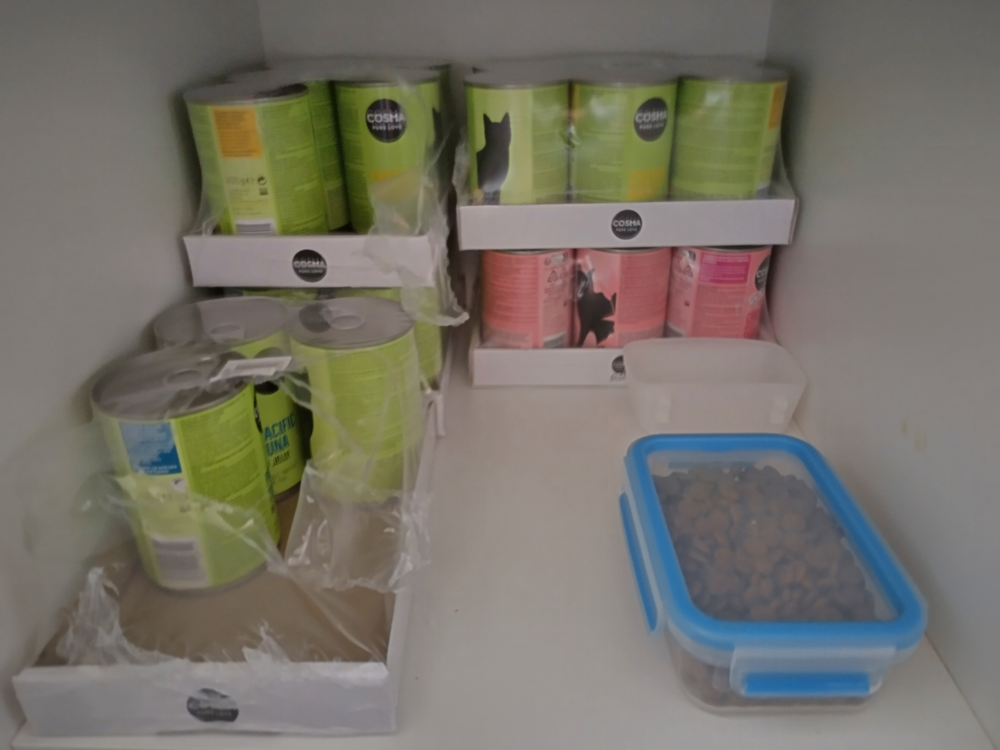
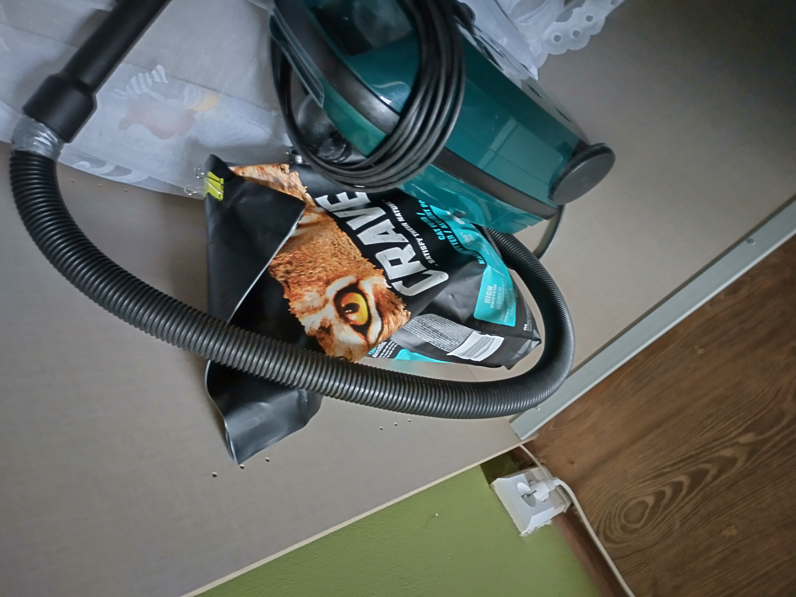
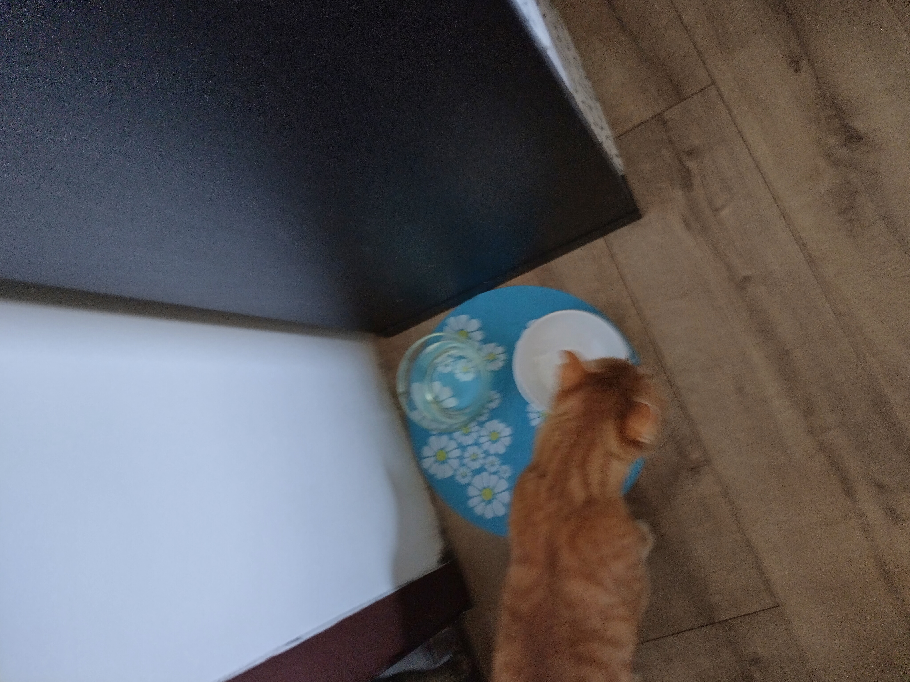
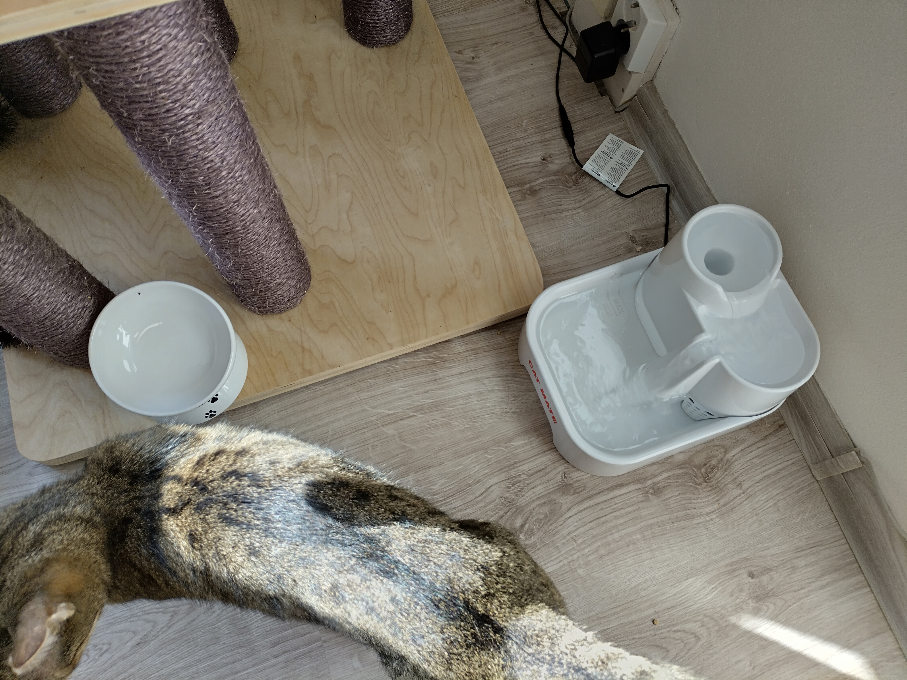
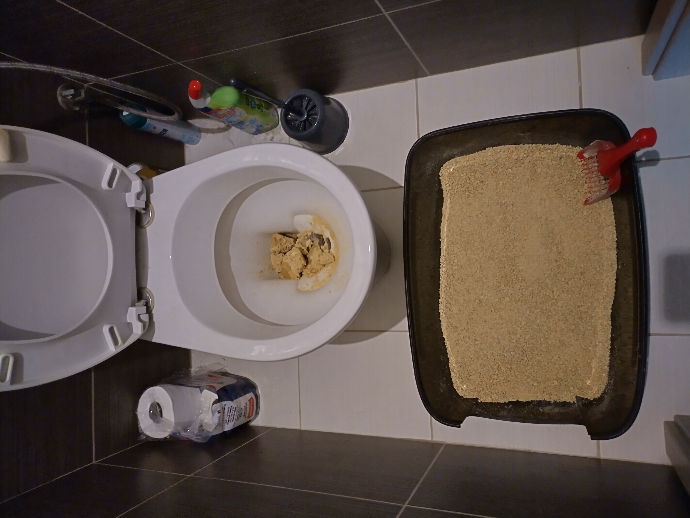

# Jedenie

- masko a cache pre granule je v skrinke vlavo od dresu

- ak dojdu granule v drese krabicka sa da doplnit v spalni v lavej skrini pri vysavaci je velky sacok s granulami

> nezabudni zavret velky sacok a skinu aby sa tam nedostali

## Davkovanie
- 1/4 konzervy na jedno jedlo 2X denne pre kazdu macku
- po dokonceni konzervy co bude za 1 den nasledujuce jedlo granule z krabicky

> vymen vodu raz za cas v miske v pracovni aj vo fontanke staci ju vyliat a napustit novu netreba nic umyvat

## Tigrik
- v pracovni
- zavrete dvere (best practice je pouzit klucku vstavanu na dverach)

## Hadik
- obyvacka

# Cistenie zachodu

- oba zachody dones do chodby, otvor a prisun k hajzlu
- prehadz hovna a chunky chcaniek do hajzla ale kusy chcaniek rozsekaj lopatkou na mensie aby sa neupchal

